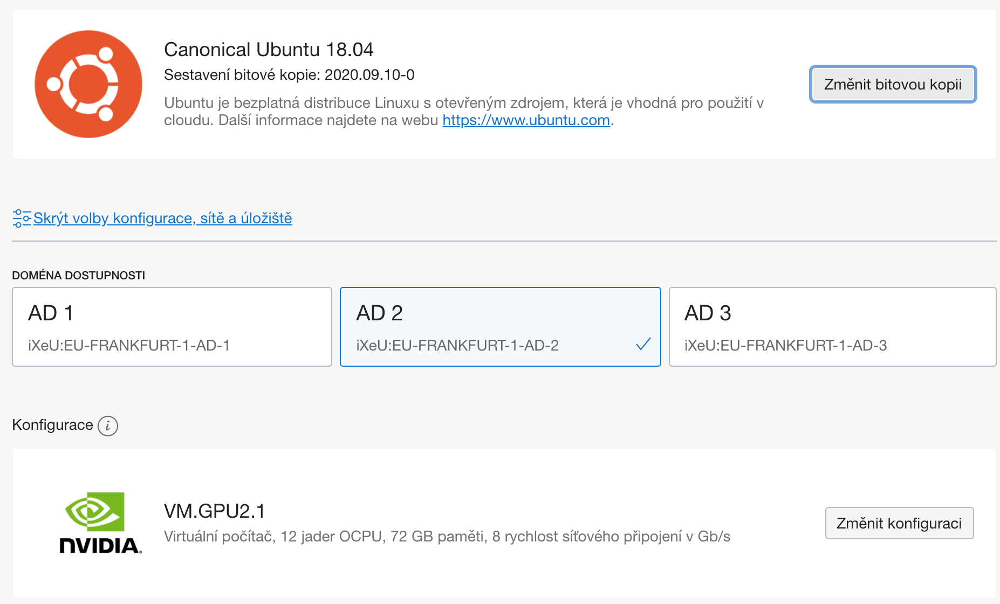

# Setting up a compute node for training on Oracle Cloud
The following tutorial will teach you how to install the nvidia driver, docker, docker-compose and also nvidia docker plugin so you can easily use your dockerized projects on the cloud.

# Pricing
The GPU instances are billed **even if stopped**. Therefore there is no reason to stop the instances. Instead, it would be wise to shutdown the instance and keep the boot volume. The following chart afaik does not include the price for the CPU, but that's negligible.

| Instance  | GPU            | Price/hr |
|-----------|----------------|----------|
| VM.GPU2.1 | 1x NVIDIA P100 | US$1.275 |
| BM.GPU2.2 | 2x NVIDIA P100 | US$2.550 |

If you have allocated boot volume, the pricing is around `US$0.03/GB/month`. So for 256GB drive it should be around 8 USD.


## Logging into the Oracle Cloud
The console can be accessed at [https://console.eu-frankfurt-1.oraclecloud.com/](https://console.eu-frankfurt-1.oraclecloud.com/). Insert `recombee` into `Cloud tenant` field. On the next page, under Single Sign-On, click continue and sign in into the Oracle Cloud Console using the provided credentials.

## Create the compute instance
Go to `Compute` -> `Instances` and click the blue `Create instance` button.

- Click the `Change byte copy` button and select `Canonical Ubuntu 18.04`
- Under `Configuration` click `Change configuration` button. 

If you have created an instance before and you have not deleted your statring volume, you can select it under `Boot volumes`.


Now we have to select which hardware is going to be used on our instance. There are 2 options, one with 1xP100 GPU and one with 2xP100 GPUs. There are also 3 availability domains. If you can't allocate a resource in one of them, try selecting a different one.

- 1xP100: Under `Virtual computer` -> `Specializations and older versions` click `VM.GPU2.1`. This instance has 12 cores and 72GB of RAM 
- 2xP100: Under `Bare metal` click `BM.GPU2.2`. This instance has 28 cores and 256GB of RAM. 


A properly configured instance should look something like this. Beneath these settings, you can also select custom size of the starting volume. If you want to make a persistent volume for yourself, it's the best to create a larger than default volume.

Last thing that needs to be done is to add your ssh keys. Scroll down under `Add SSH keys` and select `select public key` radio button. Now select your public key (e.g. `~/.ssh/id_rsa.pub`).

Now click create and your instance will be started!

## Connect to a running compute instance
By default, every instance gets a public IP. If you head to `Compute` -> `Instances` you can see the current state of the created instances and their respective IP's. To connect to an instance with ubuntu and your public key, use the following command:

```bash
ssh -i ~/.ssh/id_rsa -L 43603:127.0.0.1:43603 -L 43604:127.0.0.1:43604 ubuntu@130.61.254.173
```

The `-i` flag uses the designed private key, and the `-L` flag defines the mapping of forwarded ports to your machine. In this case we use `43603` for a jupyter notebook and `43604` for Tensorboard.

## Setting up the drivers and packages
In this step, we will install the NVIDIA drivers, docker, docker-compose and also the docker-compose nvidia plugin. The setup is described in the [setup.sh](setup.sh) file. You can either copy-paste the data, or clone this directory and run the setup.

```bash
git clone https://github.com/mskl/docker-deep-learning; sudo ./docker-deep-learning/setup.sh
```

If you want to start using the service with this `docker-deep-learning` repo, follow with setup the variables in `.env` and clone your project there. To build and run the image type

```bash
sudo make run
```

## Stopping the instance
We are paying for the time that instance existst rerardless that it's stopped or running. Navigate to `Compute` -> `Instances` click the three dots on the right side of instance. Select terminate and if needed, select the checkbox to delete the created disc. Be carefull if you want to persist your disc!!!

